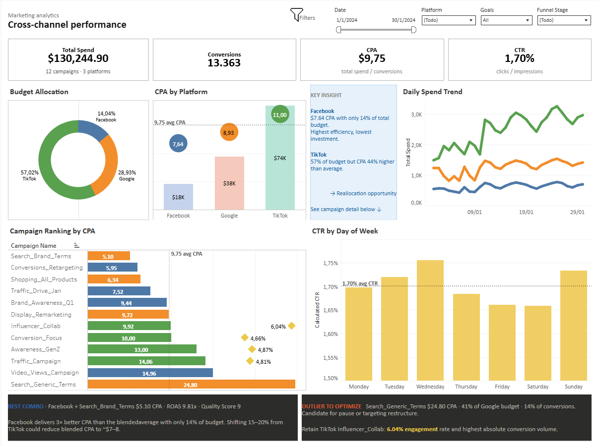

# Cross-Channel Marketing Performance Dashboard
**Improvado Technical Challenge · Senior Data Analyst Assignment**
**Gustavo Muñoz · April 2026**

---

## Overview

Unified marketing analytics dashboard integrating advertising data from Facebook, Google Ads, and TikTok into a single BigQuery dataset, visualized in Tableau Public. Built to answer the core question: **where should budget be reallocated to maximize conversion efficiency?**

**Live dashboard →** [Tableau Public](https://public.tableau.com/app/profile/gustavo.emilio.mu.oz5692/viz/Cross-channelperformance-Improvado/Cross-Channelperformance)

---

## Stack

| Layer | Tool |
|-------|------|
| Cloud database | BigQuery (`improvado-marketing` project) |
| Dataset | `marketing_analysis` |
| Visualization | Tableau Public |
| Data coverage | January 1–30, 2024 · 330 rows |

---

## Data Architecture

### Source tables
- `facebook_ads` — 110 rows
- `google_ads` — 110 rows
- `tiktok_ads` — 110 rows
- `campaign_objectives` — 12 rows (reference table)
- `unified_ads` — 330 rows (main table)

### Build logic

The SQL file (`sql/unified_ads.sql`) is structured in 4 sections:

**1. Source tables** — DDL for `facebook_ads`, `google_ads`, `tiktok_ads` with platform-specific schemas.

**2. Reference table** — `campaign_objectives` stores campaign objective and funnel stage as business facts, not presentation decisions. A separate reference table was preferred over `CASE WHEN` for maintainability.

**3. Unified table** — `UNION ALL` of the three platform sources with a `LEFT JOIN` to `campaign_objectives`. Key design decisions:
- Platform-specific fields preserved with `CAST(NULL AS ...)` for non-applicable platforms
- All derived metrics calculated at source layer (`ctr`, `cpa`, `cvr`, `cpc`, `cpm`)
- `day_of_week` and `day_of_week_num` added for day-of-week analysis
- `social_engagement_rate` for TikTok: `(likes + shares + comments) / impressions * 100`
- `video_completion_rate` for TikTok: `video_watch_100 / video_views * 100`
- `roas` for Google: `conversion_value / cost`

**4. Validation queries** — row counts by platform, totals, date range check, and NULL objective verification.

### Key SQL pattern — avoiding CASE WHEN for objectives

```sql
-- Reference table approach (preferred)
CREATE OR REPLACE TABLE campaign_objectives (
  campaign_name      STRING,
  campaign_objective STRING,  -- Awareness | Traffic | Conversion | Engagement
  funnel_stage       STRING   -- top | mid | bottom
);

-- Joined at query time
SELECT r.*, o.campaign_objective, o.funnel_stage
FROM raw_unified r
LEFT JOIN campaign_objectives o ON r.campaign_name = o.campaign_name;
```

### Key SQL pattern — SUM/SUM for blended metrics

All blended KPIs avoid the averaging-of-averages problem by aggregating from base metrics:

```sql
ROUND(SAFE_DIVIDE(SUM(cost), SUM(conversions)), 2)        AS blended_cpa
ROUND(SAFE_DIVIDE(SUM(clicks), SUM(impressions)) * 100, 4) AS blended_ctr
```

---

## unified_ads — Field Reference

### Dimensions
| Field | Description |
|-------|-------------|
| `date` | Date of the record |
| `platform` | Facebook / Google / TikTok |
| `campaign_id` | Campaign identifier |
| `campaign_name` | Campaign name |
| `ad_group_id` | Ad group identifier |
| `ad_group_name` | Ad group name |
| `campaign_objective` | Awareness / Traffic / Conversion / Engagement |
| `funnel_stage` | top / mid / bottom |
| `day_of_week` | Monday–Sunday |
| `day_of_week_num` | 1–7 (DAYOFWEEK convention) |

### Universal metrics
| Field | Description |
|-------|-------------|
| `impressions` | Total impressions |
| `clicks` | Total clicks |
| `cost` | Total spend |
| `conversions` | Total conversions |
| `ctr` | clicks / impressions |
| `avg_cpc` | cost / clicks |
| `cvr` | conversions / clicks |
| `cpa` | cost / conversions |
| `cpm` | cost × 1000 / impressions |

### Platform-specific fields
| Field | Platform |
|-------|----------|
| `reach`, `frequency`, `engagement_rate` | Facebook only |
| `conversion_value`, `roas`, `quality_score`, `search_impression_share` | Google only |
| `video_watch_25/50/75/100`, `video_completion_rate`, `likes`, `shares`, `comments`, `social_engagement_rate` | TikTok only |

---

## Tableau Dashboard — Functionalities

### Filters
Four filters control all charts simultaneously:
- **Date range** — slider covering Jan 1–30 2024
- **Platform** — Facebook / Google / TikTok / All
- **Goals** — Awareness / Traffic / Conversion / Engagement / All
- **Funnel Stage** — top / mid / bottom / All

### KPI highlight mechanic
A `Selected Objective` parameter (string, default: `All`) drives 7 calculated fields that highlight relevant KPIs per objective:

| Objective | Highlighted KPIs |
|-----------|-----------------|
| Awareness | Impressions, CTR |
| Traffic | CTR, CPC |
| Conversion | Conversions, CPA |
| Engagement | CVR, Impressions |
| All | Total Spend (neutral) |

Non-highlighted KPIs fade to neutral gray (`#D3D1C7`). Activated via a Parameter Action on the dashboard: clicking any campaign objective updates `Selected Objective` automatically.

### Calculated fields — key formulas
All blended metrics use SUM/SUM aggregation to avoid the averaging-of-averages problem:

```
Calculated CPA   = SUM([Cost]) / SUM([Conversions])
Calculated CTR   = SUM([Clicks]) / SUM([Impressions])
Calculated CVR   = SUM([Conversions]) / SUM([Clicks])
Calculated CPC   = SUM([Cost]) / SUM([Clicks])

ROAS Tooltip     = IF MIN([Platform]) = "Google"
                   THEN "ROAS: " + STR(ROUND(AVG([Roas]), 2)) + "x"
                   ELSE "" END

Quality Score Tooltip = IF MIN([Platform]) = "Google"
                        THEN "Quality Score: " + STR(ROUND(AVG([Quality Score]), 0)) + "/10"
                        ELSE "" END

Engagement Rate (TikTok) = IF MIN([Platform]) = "TikTok"
                            THEN [Social Engagement Rate]
                            ELSE NULL END
```

### Dashboard sheets

| Sheet | Type | Description |
|-------|------|-------------|
| KPI - Total Spend | Single value | SUM(Cost) with campaign/platform count subtitle |
| KPI - Impressions | Single value | SUM(Impressions) |
| KPI - Conversions | Single value | SUM(Conversions) |
| KPI - CPA | Single value | Calculated CPA · highlight: Conversion |
| KPI - CTR | Single value | Calculated CTR · highlight: Awareness, Traffic |
| KPI - CVR | Single value | Calculated CVR · highlight: Conversion, Engagement |
| KPI - CPC | Single value | Calculated CPC · highlight: Traffic |
| Budget Allocation | Donut chart | % of total spend by platform |
| CPA by Platform | Bar + dot (dual axis) | Bar = spend · dot = CPA · ref line = $9.75 |
| Daily Spend Trend | Line chart | Daily cost by platform, Jan 1–30 |
| Campaign Ranking by CPA | Bar + scatter (dual axis) | Bar = CPA by platform · diamond = TikTok engagement rate |
| CTR by Day of Week | Bar chart | Avg CTR by day, sorted Mon–Sun · ref line = avg |

### Color palette

| Platform | Primary | Light |
|----------|---------|-------|
| Facebook | `#3266AD` | `#C5D4EC` |
| Google | `#D85A30` | `#F5C9BB` |
| TikTok | `#1D9E75` | `#B8E4D8` |

| Objective | Highlight | Neutral |
|-----------|-----------|---------|
| Awareness | `#E6F1FB` | `#D3D1C7` |
| Traffic | `#FAEEDA` | `#D3D1C7` |
| Conversion | `#E1F5EE` | `#D3D1C7` |
| Engagement | `#FBEAF0` | `#D3D1C7` |

---

## Validated KPIs (full period, no filters)

| Metric | Value |
|--------|-------|
| Total Spend | $130,244.90 |
| Impressions | 40,473,185 |
| Clicks | 688,333 |
| Conversions | 13,363 |
| Blended CPA | $9.75 |
| Blended CTR | 1.70% |
| Blended CVR | 1.94% |
| Blended CPC | $0.19 |

---

## Campaign Reference

| Campaign | Platform | Objective | Funnel | CPA |
|----------|----------|-----------|--------|-----|
| Search_Brand_Terms | Google | Awareness | top | $5.10 |
| Conversions_Retargeting | Facebook | Conversion | bottom | $5.95 |
| Shopping_All_Products | Google | Conversion | bottom | $6.34 |
| Influencer_Collab | TikTok | Engagement | mid | $6.92 |
| Traffic_Drive_Jan | Facebook | Traffic | mid | $7.52 |
| Brand_Awareness_Q1 | Facebook | Awareness | top | $9.44 |
| Display_Remarketing | Google | Conversion | bottom | $9.72 |
| Conversion_Focus | TikTok | Conversion | bottom | $10.00 |
| Awareness_GenZ | TikTok | Awareness | top | $13.00 |
| Traffic_Campaign | TikTok | Traffic | mid | $14.06 |
| Video_Views_Campaign | Facebook | Awareness | top | $14.95 |
| Search_Generic_Terms | Google | Traffic | mid | $24.80 ⚠ |

---

## Key Insights

**1. Volume ≠ efficiency**
TikTok received 57% of total budget ($74K) and leads in absolute conversions — but delivers the highest CPA at $11.00. Facebook received only 14% ($18K) with the fewest conversions, yet achieves the lowest CPA at $7.64. A 44% efficiency gap driven by budget misallocation.

**2. Best campaign: Search_Brand_Terms (Google)**
$5.10 CPA · ROAS 9.81x · Quality Score 9. Strongest ROI across all platforms and campaigns.

**3. Main outlier: Search_Generic_Terms (Google)**
$24.80 CPA consuming 41% of Google's budget but delivering only 14% of Google's conversions. First candidate for pause or targeting restructure.

**4. Retention case: Influencer_Collab (TikTok)**
$6.92 CPA with 6.04% social engagement rate — highest awareness asset in the mix. Worth retaining despite TikTok's overall efficiency gap.

**5. Weekend opportunity**
CTR consistently peaks on Saturday and Sunday above the 1.70% weekly average. Shifting budget weight toward weekends is a low-effort optimization for awareness and traffic campaigns.

---

## Recommendation

Reallocate 15–20% of TikTok's budget toward Facebook and Google branded search. Based on current CPA differentials, that shift could reduce blended CPA from $9.75 to approximately $7–8 — without increasing total spend.

---



## Author

**Gustavo Emilio Muñoz** · Senior Data Analyst
[www.linkedin.com/in/gustavo-emilio-muñoz](https://linkedin.com/in/gustavo-emilio-muñoz)
